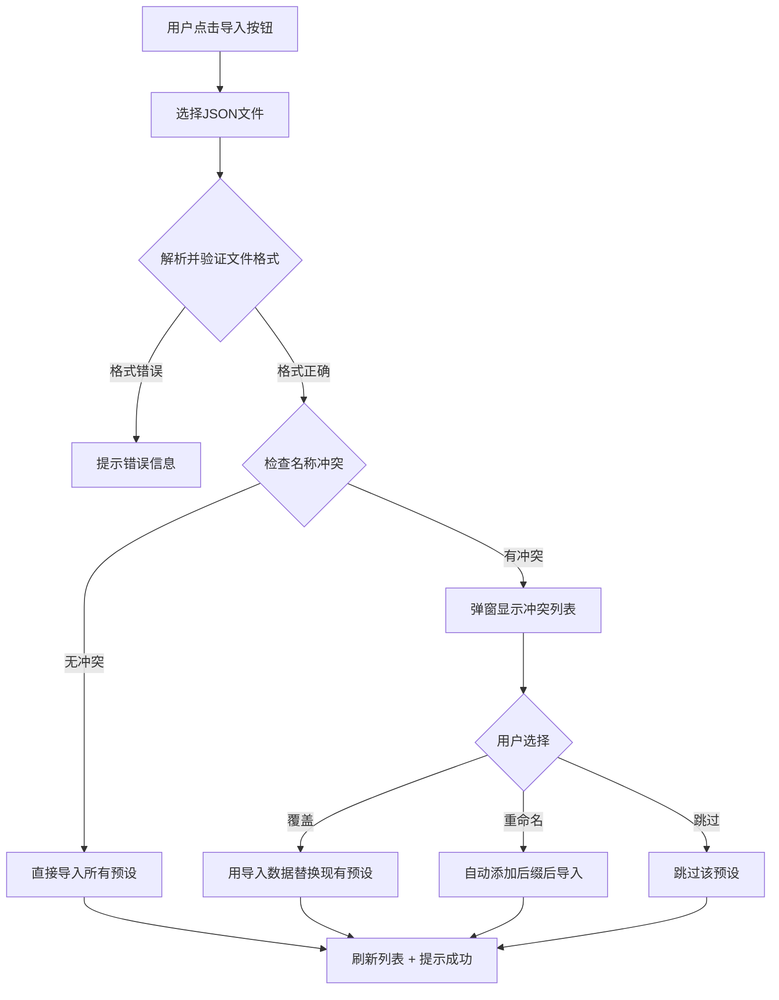

# 自定义开局预设导入/导出功能设计

## 概述

为自定义开局系统添加预设的导入和导出功能，允许用户跨角色卡分享预设配置。

## 现有系统

- 预设通过 `preset-manager.ts` 管理，存储在角色卡变量（`character` 类型）中
- 预设数据结构为 `CharacterPreset`，包含角色配置、装备、道具、技能、伙伴、背景
- UI 入口在 `PresetModal.vue`，支持保存/加载/删除预设

## 功能设计

### 导出功能

#### 单个预设导出
- 每个预设项的操作区域新增「导出」按钮
- 点击后将该预设序列化为 JSON 文件并触发浏览器下载
- 文件名格式：`预设名称.preset.json`

#### 批量导出
- 预设列表区域顶部新增「全部导出」按钮
- 将所有预设打包为一个 JSON 文件下载
- 文件名格式：`所有预设_日期.presets.json`

#### 导出文件格式

```json
{
  "version": 1,
  "type": "single" | "batch",
  "exportedAt": 1234567890,
  "presets": [CharacterPreset, ...]
}
```

### 导入功能

#### 导入入口
- 保存区域附近新增「导入预设」按钮
- 点击后打开文件选择器，支持选择 `.json` 文件

#### 导入流程



#### 冲突处理弹窗
- 列出所有冲突的预设名称
- 每个冲突项提供三个选项：覆盖/重命名/跳过
- 底部提供「全部覆盖」「全部跳过」快捷操作

### 数据验证

导入时需要验证：
1. JSON 格式正确性
2. 必须包含 `version` 和 `presets` 字段
3. 每个预设必须包含 `name`、`character` 等核心字段
4. 兼容旧版预设（复用现有的 `migratePresetCharacter` 逻辑）

## 修改文件清单

| 文件 | 修改内容 |
|------|---------|
| `src/custom_start/core/utils/preset-manager.ts` | 新增 `exportPreset`、`exportAllPresets`、`importPresets`、`validatePresetFile` 函数 |
| `src/custom_start/core/components/PresetModal.vue` | 新增导入/导出按钮 UI、冲突处理弹窗 |

## UI 布局

```
┌─────────────────────────────────────────┐
│  预设管理                            ✕  │
├─────────────────────────────────────────┤
│  💾 保存当前配置                        │
│  [输入预设名称...    ] [保存预设]        │
│                                         │
│  📥 导入预设                            │
│  [导入预设文件]                         │
│─────────────────────────────────────────│
│  📋 已保存的预设          [全部导出]     │
│  ┌─────────────────────────────────┐    │
│  │ 预设名A  2024/01/01            │    │
│  │ 👤 角色名 ⭐Lv.5 🛡3 ✨2 ❤1  │    │
│  │     [加载] [导出] [删除]        │    │
│  └─────────────────────────────────┘    │
│  ┌─────────────────────────────────┐    │
│  │ 预设名B  2024/01/02            │    │
│  │ 👤 角色名 ⭐Lv.3 🛡1 ✨1 ❤0  │    │
│  │     [加载] [导出] [删除]        │    │
│  └─────────────────────────────────┘    │
├─────────────────────────────────────────┤
│                            [关闭]       │
└─────────────────────────────────────────┘
```
